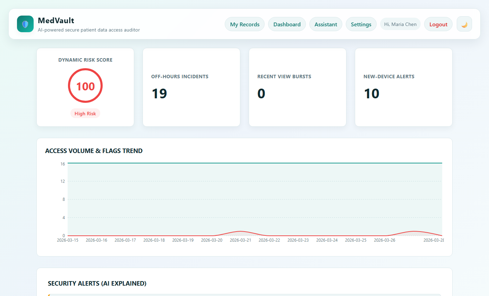
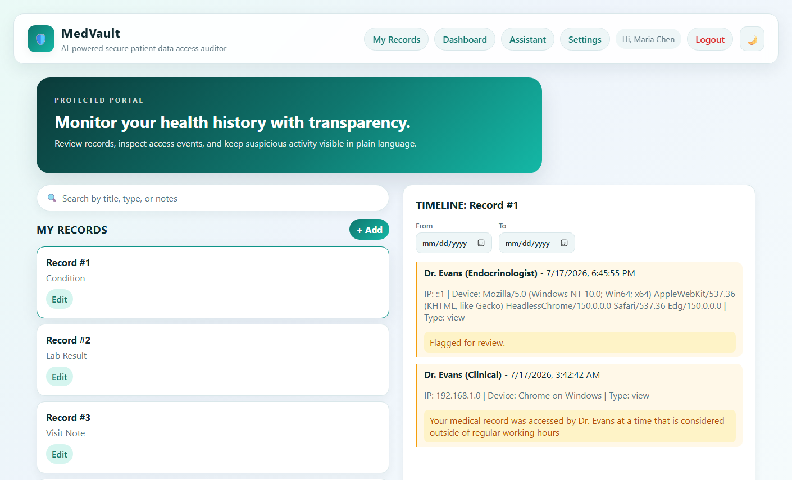
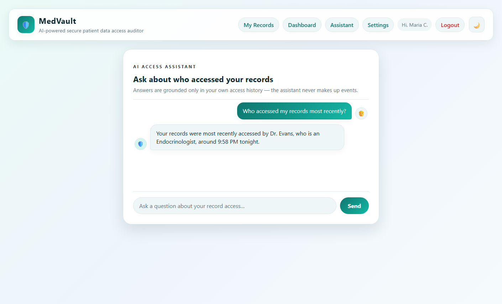
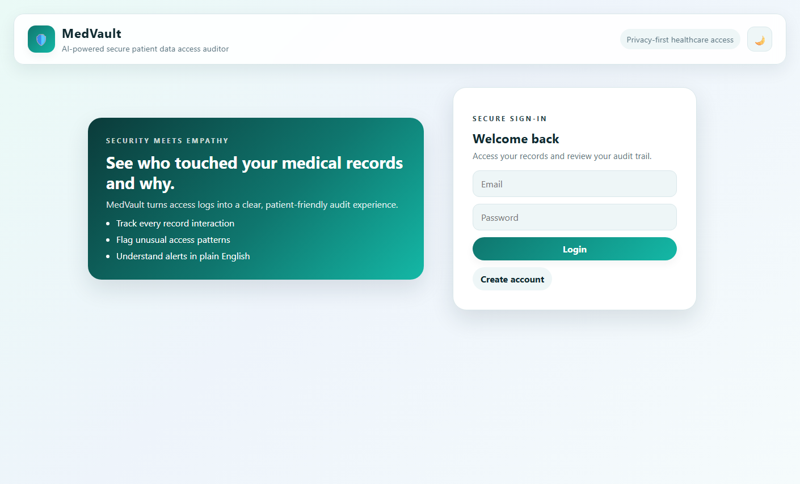
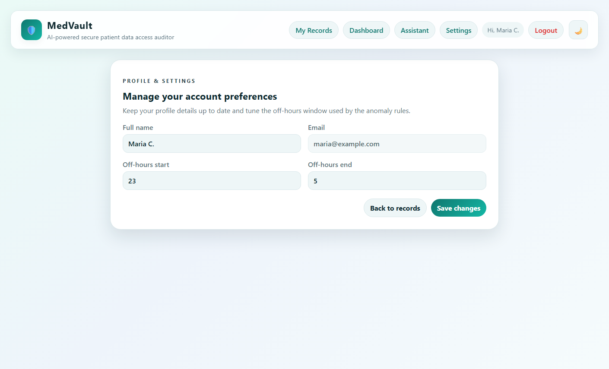
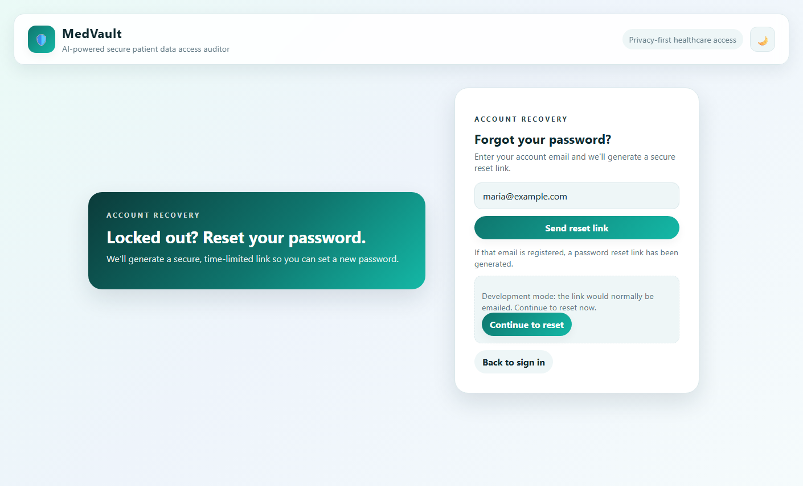
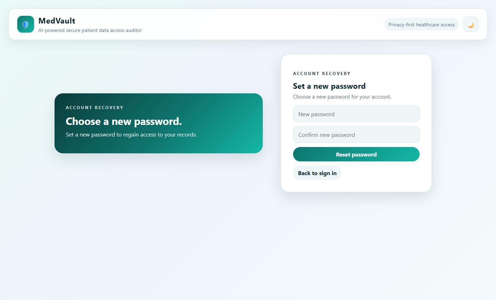
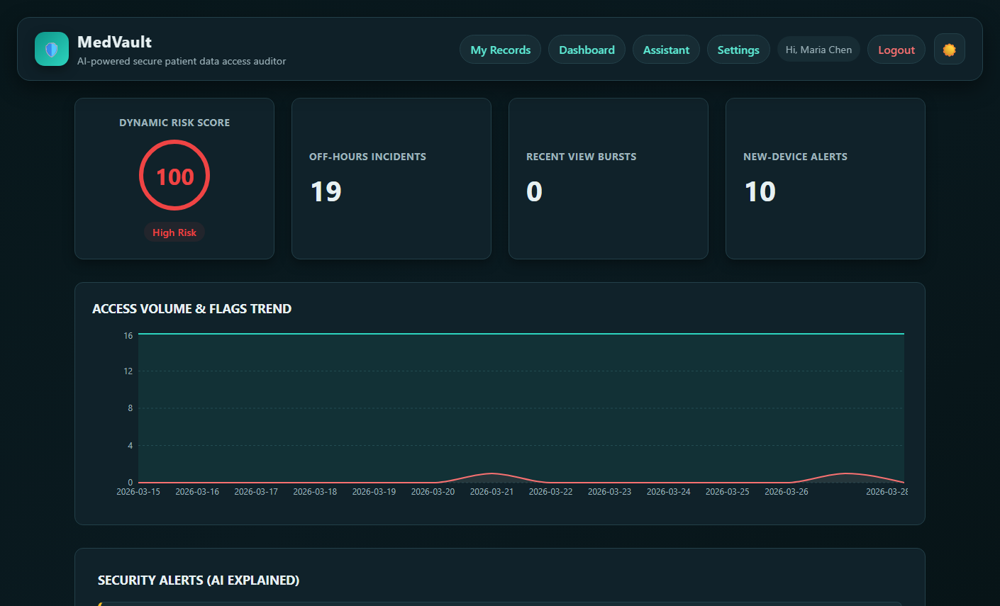
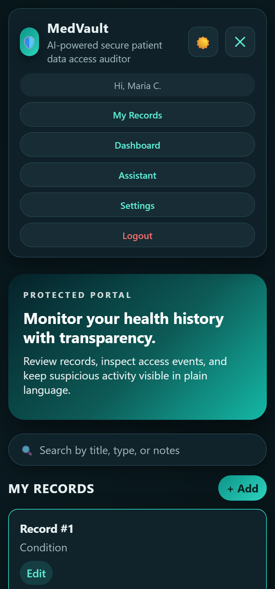

# MedVault

**Author:** Ahmed Furkhan

**Class link:** _[add your course/section link here]_

**Design document:** [MedVault_Design_Document.docx](./design/MedVault_Design_Document.docx)

**Presentation:** [MedVault_Presentation.pptx](./design/MedVault_Presentation.pptx)

## Project Objective

MedVault is a privacy-first, AI-assisted access auditor for patient medical records. It helps patients inspect who accessed their records and why, with flagged anomalies and a risk dashboard that explains each alert in plain English.

## Screenshots

### Risk dashboard



### Records & access timeline



### AI access assistant (grounded, multi-turn)



### Login



### Settings



### Password reset (secure token link)

|                     Forgot password                     |                    Set new password                    |
| :------------------------------------------------------: | :----------------------------------------------------: |
|  |  |

### Dark mode & responsive

|                      Dashboard (dark)                      |                   Mobile menu (dark)                   |
| :---------------------------------------------------------: | :----------------------------------------------------: |
|  |  |

## Tech Stack

- **Frontend:** React 18 (Hooks) + Vite, Recharts, Fetch API
- **Backend:** Node + Express, MongoDB (native driver), Passport (local strategy), express-session, bcrypt
- **AI:** Groq API for plain-English anomaly explanations

## How to build and run locally

Prerequisites: Node 18+, npm, and MongoDB running locally or a MongoDB Atlas URI.

### 1. Backend

Create `backend/.env` (copy from `backend/.env.example`):

```
PORT=5000
MONGO_URI=mongodb://127.0.0.1:27017/medvault
SESSION_SECRET=replace_with_a_strong_secret
GROQ_API_KEY=your_groq_api_key_here
```

Install, seed the database, and start:

```bash
cd backend
npm install
npm run seed   # creates test user maria@example.com / password123 + 1k+ synthetic records
npm run dev
```

### 2. Frontend

```bash
cd frontend
npm install
npm run dev
```

Open the app at `http://localhost:5173`. The Vite dev server proxies `/api` requests to the backend on port 5000, so the app runs same-origin with no CORS needed.

### Production build

Build the frontend and let Express serve it (single origin, no CORS):

```bash
cd frontend
npm run build
cd ../backend
NODE_ENV=production npm start
```

Then open `http://localhost:5000`.

### Docker (optional)

```bash
docker build -t medvault:latest .
docker run --env MONGO_URI=... --env SESSION_SECRET=... --env GROQ_API_KEY=... -p 5000:5000 medvault:latest
```

## Usage

1. Register a new account, or log in with the seeded account `maria@gmail.com` / `password123`.
2. **My Records** — create, view, edit, and delete medical records. Selecting a record opens its access timeline.
3. **Dashboard** — review your risk score, off-hours incidents, view-burst counts, the access-trend chart, and AI-explained security alerts.
4. **Settings** — update your profile and off-hours window used by the anomaly rules.

## Notes

- Default seeded credentials: `maria@gmail.com` / `password123`.
- Secrets are read from environment variables and are never committed. `backend/.env` is git-ignored; only `backend/.env.example` (placeholders) is tracked.
- The frontend optionally reads `VITE_API_BASE` for a custom production API origin; leave it unset to use the same origin.

## License

MIT — see [LICENSE](./LICENSE).
