# MedVault

**Author:** Ahmed Furkhan

**Class:** CS 5610 Web Development — Northeastern University

**Class link:** https://johnguerra.co/classes/webDevelopment_online_summer_2026/

**Design document:** [MedVault_Design_Document.docx](./design/MedVault_Design_Document.docx)

**Presentation:** [MedVault_Presentation.pptx](./design/MedVault_Presentation.pptx)

**Usability study report:** [MedVault_Usability_Study_Report.docx](./design/MedVault_Usability_Study_Report.docx)

**Deploy Link:** [https://medvault-jh8r.onrender.com/](https://medvault-jh8r.onrender.com/)

## Project Objective

MedVault is a privacy-first, AI-assisted access auditor for patient medical records. It helps patients inspect who accessed their records and why, with flagged anomalies and a risk dashboard that explains each alert in plain English.

## Screenshots

### Risk dashboard

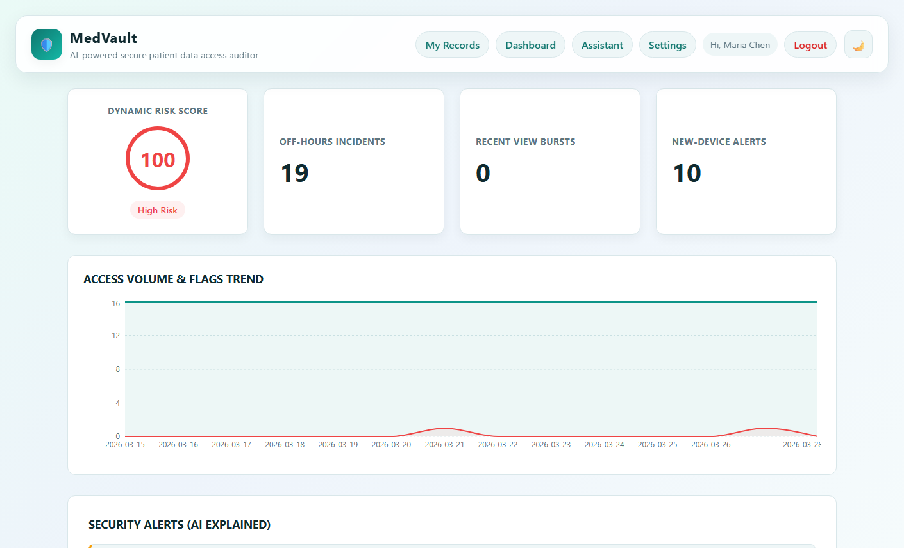

### Records & access timeline

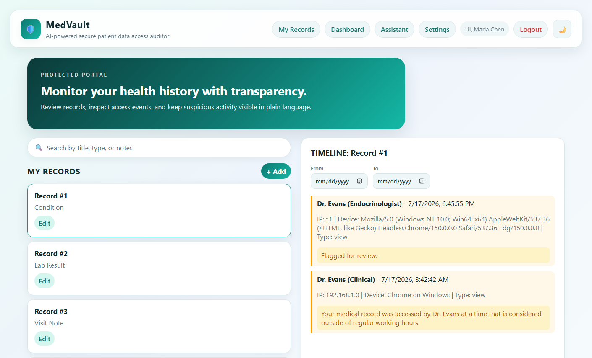

### AI access assistant (grounded, multi-turn)

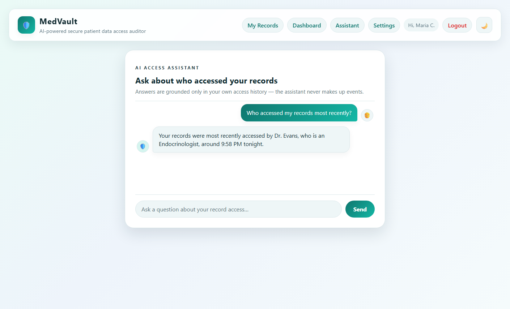

### Doctor / provider portal

A doctor logs in to browse their patients and open records. **Every record a doctor opens is written to that patient's access audit**, so the patient sees exactly who viewed their data — closing the transparency loop.

|                      Patient list                       |                Record view (access logged)                |
| :-----------------------------------------------------: | :-------------------------------------------------------: |
| 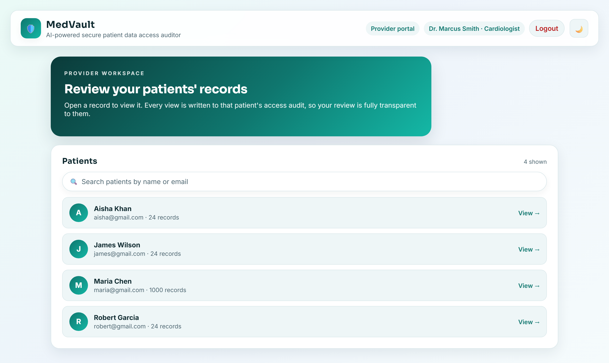 | 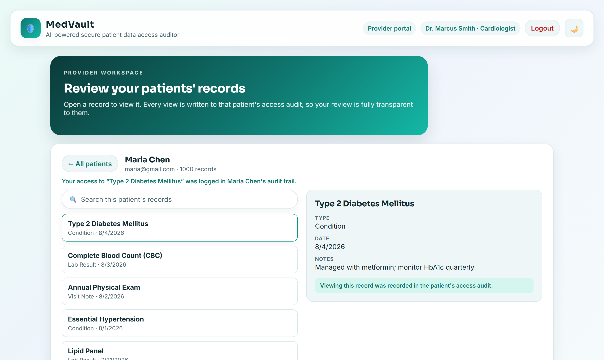 |

The loop closes on the **patient's** side: when the patient signs in, the doctor's view shows up in their own access timeline (here flagged, since it came from a new device):

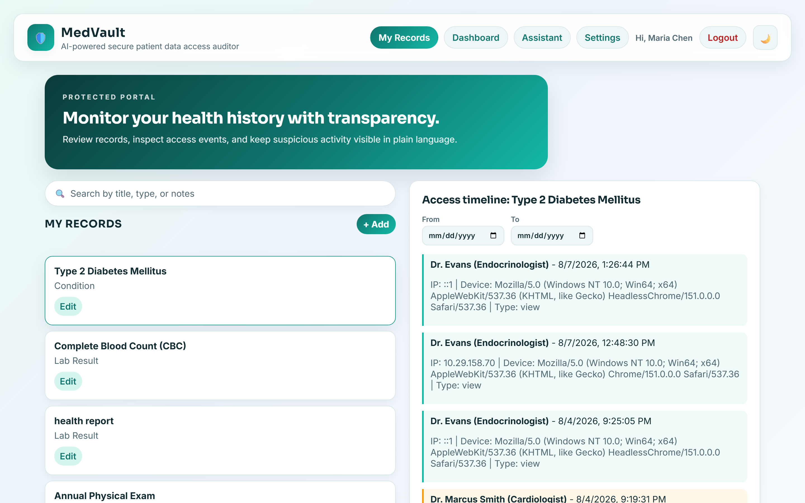

### Login

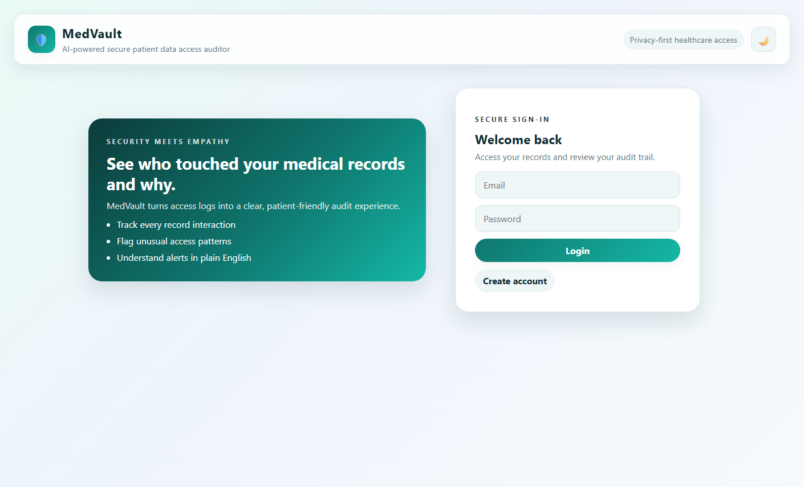

### Settings

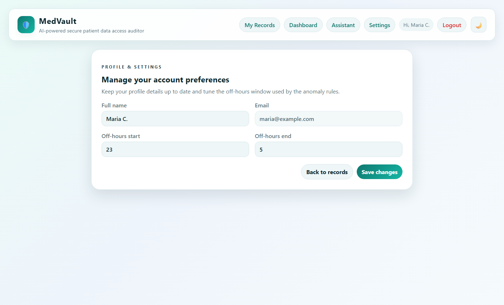

### Password reset (secure token link)

|                     Forgot password                     |                    Set new password                    |
| :------------------------------------------------------: | :----------------------------------------------------: |
| 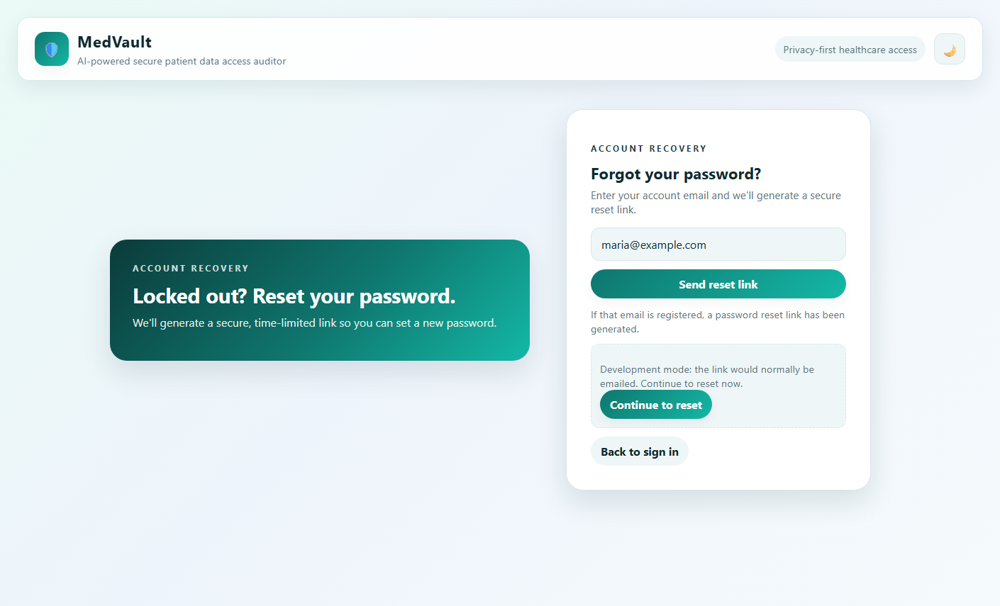 | 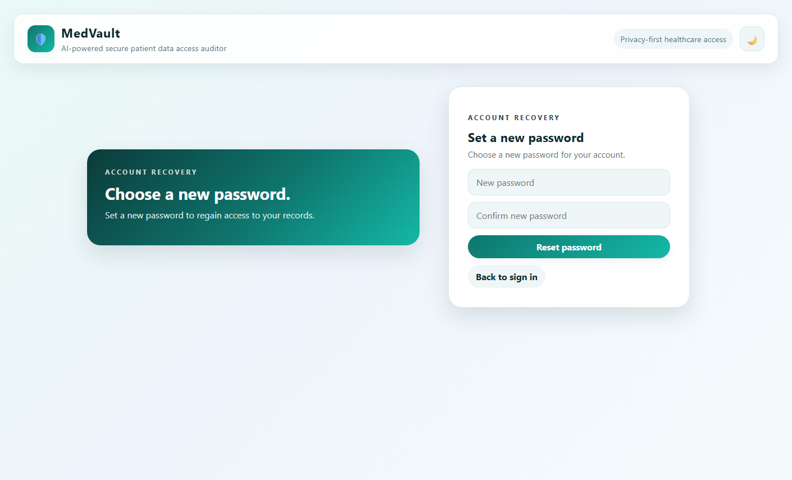 |

### Dark mode & responsive

|                      Dashboard (dark)                      |                   Mobile menu (dark)                   |
| :---------------------------------------------------------: | :----------------------------------------------------: |
| 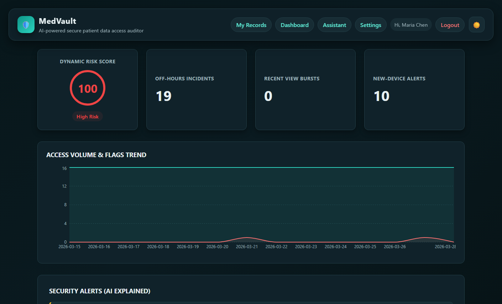 | 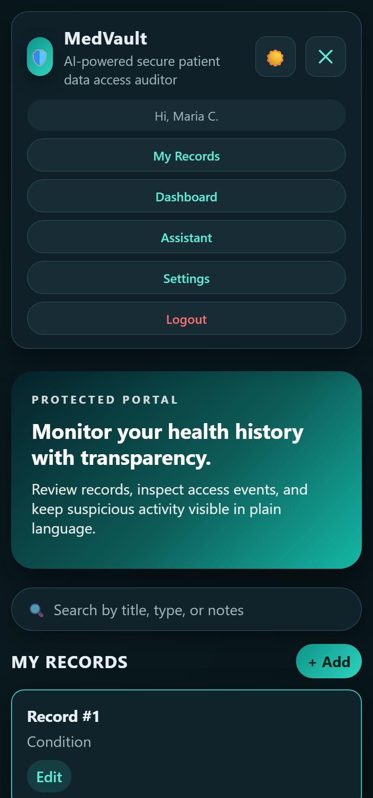 |

## Tech Stack

- **Frontend:** React 18 (Hooks) + Vite, Recharts, Fetch API
- **Backend:** Node + Express, MongoDB (native driver), Passport (local strategy), express-session, bcrypt
- **AI:** Groq API for plain-English anomaly explanations

## How to build and run locally

Prerequisites: Node 18+, npm, and MongoDB running locally or a MongoDB Atlas URI.

### 1. Backend

Create `backend/.env` (copy from `backend/.env.example`):

```
PORT=5000
MONGO_URI=create_MongoDB/medvault
SESSION_SECRET=replace_with_a_strong_secret
GROQ_API_KEY=your_groq_api_key_here
```

Install, seed the database, and start:

```bash
cd backend
npm install
npm run seed   # creates test user maria@gmail.com / password123 + 1k+ synthetic records
npm run dev
```

### 2. Frontend

```bash
cd frontend
npm install
npm run dev
```

Open the app at `http://localhost:5173`. The Vite dev server proxies `/api` requests to the backend on port 5000, so the app runs same-origin with no CORS needed.

### Production build

Build the frontend and let Express serve it (single origin, no CORS):

```bash
cd frontend
npm run build
cd ../backend
NODE_ENV=production npm start
```

Then open `http://localhost:5000`.

### Docker (optional)

```bash
docker build -t medvault:latest .
docker run --env MONGO_URI=... --env SESSION_SECRET=... --env GROQ_API_KEY=... -p 5000:5000 medvault:latest
```

## Usage

There are two roles. The app shows the right portal automatically based on the account you log in with.

### Patient (default)

Log in with the seeded patient `maria@gmail.com` / `password123`, or register a new account (the register form lets you pick **Patient** or **Doctor**).

1. **My Records** — create, view, edit, and delete medical records; attach a report file (PDF/JPG/PNG). Selecting a record opens its access timeline.
2. **Dashboard** — review your risk score, off-hours incidents, view-burst counts, the access-trend chart, and AI-explained security alerts.
3. **Assistant** — ask, in plain language, who accessed your records; answers are grounded only in your own history.
4. **Settings** — update your profile and off-hours window used by the anomaly rules.

### Doctor / provider

**Log in with the seeded doctor account `doctor@medvault.com` / `password123`** (or register and choose **Doctor**). You'll land on the **Provider portal**:

1. Browse or search your **patient list**.
2. Open a patient to see their **records**, then open a record to view it.
3. **Every record you open is written to that patient's access audit** — so when the patient signs in, they see exactly who viewed their data (e.g. _"Dr. Marcus Smith (Cardiologist)"_ in their timeline). This closes the transparency loop.

## Notes

- Seeded logins (all password `password123`): patient `maria@gmail.com`, doctor `doctor@medvault.com`, plus a few extra patients (`james@gmail.com`, `aisha@gmail.com`, `robert@gmail.com`).
- Secrets are read from environment variables and are never committed. `backend/.env` is git-ignored; only `backend/.env.example` (placeholders) is tracked.
- The frontend optionally reads `VITE_API_BASE` for a custom production API origin; leave it unset to use the same origin.

## Design & Accessibility

This iteration focused on design, usability, and accessibility:

- **Typography:** a two-face system — **Sora** for display headings and **Inter** for body — loaded from Google Fonts, with a corrected `h1 → h2 → h3` heading hierarchy (no skipped levels).
- **Color:** a consistent teal brand palette (`--brand` / `--brand-grad`) with fixed approve (teal) vs. cancel/destructive (red `--danger`) semantics across every screen, plus theme-aware, WCAG-AA risk-band colors and full light/dark support.
- **Keyboard:** the whole app is operable without a mouse — a "Skip to main content" link, a single high-contrast `:focus-visible` ring everywhere, `aria-current` on the active nav item, and a true modal dialog (focus trap, `Escape` to close, focus restored to the trigger).
- **Screen readers:** every input has a programmatic `<label>` and `autocomplete`; the risk gauge is a labelled `role="meter"`; the trend chart has a text alternative; flagged events are announced by more than color; and live regions announce assistant replies, pagination, and save status.
- **Verified:** ESLint clean, Prettier-formatted, and **0 axe-core violations** across all views in both light and dark themes.

### CRAP principles

- **Contrast:** primary (teal, filled) vs. secondary (outline) vs. destructive (red) actions are visually very different, never merely similar; type sizes step clearly between heading and body.
- **Repetition:** shared design tokens (color, radius `999px` pills, spacing, shadow, focus ring) are reused across every component, so the UI reads as one system.
- **Alignment:** content sits on a consistent left-aligned grid within cards; the portal and dashboard use a real column grid rather than ad-hoc centering.
- **Proximity:** related controls are grouped (search + list + pagination in one column; a record and its timeline side by side; form fields with their labels), with generous whitespace separating unrelated groups.

### Shneiderman's 8 Golden Rules

1. **Strive for consistency** — one component/token system, consistent nav and button semantics.
2. **Cater to universal usability** — full keyboard operation, screen-reader labels, light/dark, responsive/mobile menu.
3. **Offer informative feedback** — live-region status for saves ("Record added / Changes saved / Record deleted"), assistant typing, and pagination.
4. **Design dialogs to yield closure** — the record dialog and the delete-confirmation both resolve to a clear end state and a confirmation message.
5. **Prevent errors** — required fields, typed inputs (date/number with min–max), and a two-step confirmation before a destructive delete.
6. **Permit easy reversal of actions** — every dialog has Cancel; delete asks first with a "Keep record" escape; Escape closes dialogs.
7. **Support internal locus of control** — the user drives navigation and actions; nothing auto-submits or auto-centers unexpectedly.
8. **Reduce short-term memory load** — persistent field labels (not placeholder-only), a visible active-nav indicator, suggested assistant prompts, and inline hints (e.g., the off-hours window explanation).

See the [usability study report](./design/MedVault_Usability_Study_Report.docx) for the study that motivated these changes.

## License

MIT — see [LICENSE](./LICENSE).
